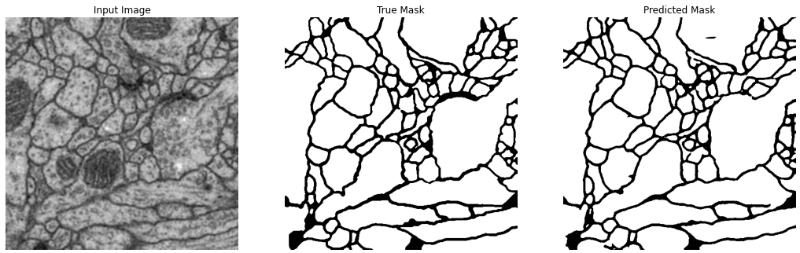
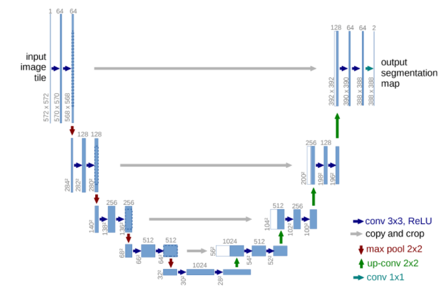
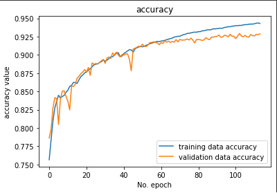
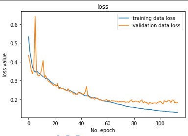

# Segmentation

The objective of this project is to be able to segment medical image. To do so, we have 29 labelised picture from drosophilia brain. But as we know, 29 pictures is not enought to train a model, so that bring us to the first step of the project.

## Data augmentation

The first step was to transform .tiff images to png. This convertion was done with a simple script that go througt our file and save them as png.

To understand the data augmentation process, the first step is to know what our model will be expecting. Earlier, we said that we had 29 labellised pictures, so what are they ? 
The label is a mask, and it is what we expect from our model to predict. It is taken from the input image and was made by hand. It represent the border of brain cells. So, if we want to increase our number of labellised picture in the dataset, we just have to apply transformation (such as rotation, or flip) to the input picture, and then apply the exact same transformation to it associated mask.

After that, we just saved the 2 new pictures (input & mask) inside our dataset.

The script to do that is available in the [segmentation augmentation notebook](segmentation_augmentation.ypynb)

## Segmentation model

### U-net architecture

The do the segmentation of picture, there is already a model that was made. This is the u-net model.
U-Net is a convolutional neural network that was developed for biomedical image segmentation at the Computer Science Department of the University of Freiburg.The network is based on the fully convolutional network and its architecture was modified and extended to work with fewer training images and to yield more precise segmentations.
 
The architecture is made like this :

In this  u-net architecture, there are 5 layers with each one 2 conv layers to encode the picture and 5 layers to transpose and decode the picture. We used the exact same architecture to train our model.

For our model, we had a memory problem with this network, so we had to reduce the numbre of filter of each layer by 4.

### Preparation and traing

To prepare the dataset for training, the work wasn't that big. In fact, we just had to append our image wich were already in grayscale and 512x512 to our train set.

The next step was to create and train the model, wich was done on [this notebook](segmentation_model.ypynb) in google collab.

### Results

The difficulty in the segmentation problem is to evaluate our model. Here, i have decided use the accuracy. If we consider the probleme pixel b pixel, it can be assimilate to a classification problem. Each pixel value can be either 0 or 255.

On the validation split, we have an accuracy of 92% wich is a good score.

Our loss value is good to, wich show us that we don't have an overfitting problem. 

We can clearly see that our validation loss stay higher than the training data loss.

The final result is really good when we look at it.

## Conclusion

With a model where the number of filter is divised by 4, we already have pretty good results, it would have been interesting to be able to try it with the original value.

